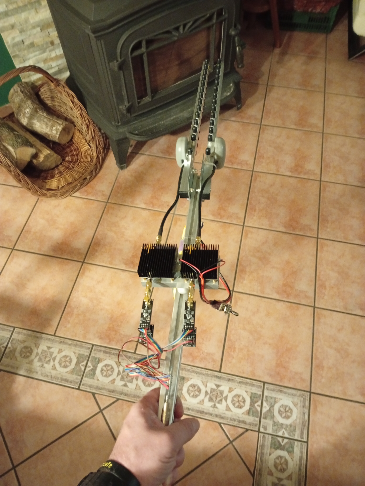
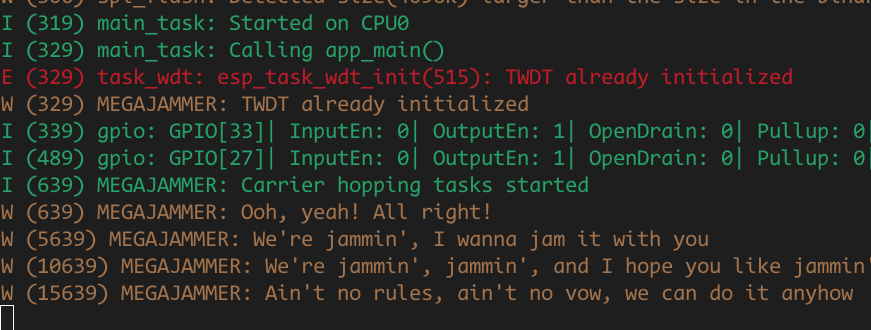

# MEGAJAMMER
## **The 2.54 GHz Annoyance Cannon**

A janky yet effective directional jammer built from the finest garbage  AliExpress has to offer. Perfect for shutting down obnoxious Bluetooth  speakers, questionable IoT devices, and the occasional Wi-Fi network  

This is **illegal** in most civilized places. If the cyberpolice or any ham enthusiasts catches you, you'll be in hell.

I generated a list of channels for BT, WiFi 2.4, and Zigbee, but only tested BT. 

**This project is presented for educational and experimental purposes only.**

- **This is not a commercial product**
- **No schematics, support, or documentation are provided**
- **I am not affiliated with any manufacturer or distributor of this device**
- **I do not endorse or promote the use of this device**

**Do not use**

## Weaponizing Aliexpress

1. **NRF24L01+ Modules** – Cheap 2.4GHz transmitters set to blast carrier frequency at max power while  hopping on a list of channels.
2. **Sketchy RF Amplifiers** – Cheap and messy ~~like your mom~~
3. **Yagi Antennas** – Because i needed this to be directional, not only because it looks mean.

Add more modules if you want to spit on more channels.

On this image: Early stage of developpement, it looks and acts like a big magic wand.

## Demo

https://www.tiktok.com/@tixlegeek/video/7528507039304240406

## Next

I'll make a more polished revision when i'll have time.

Hpphckng!
