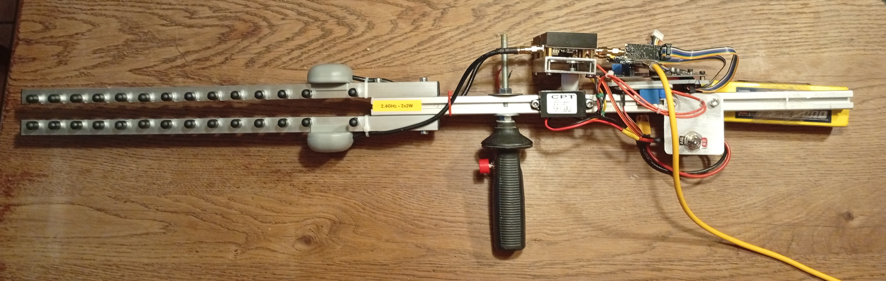
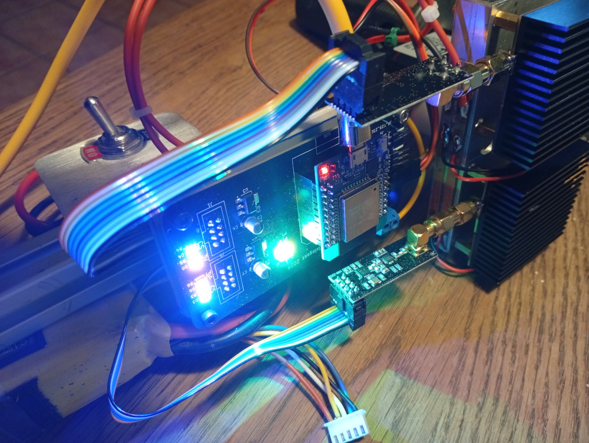
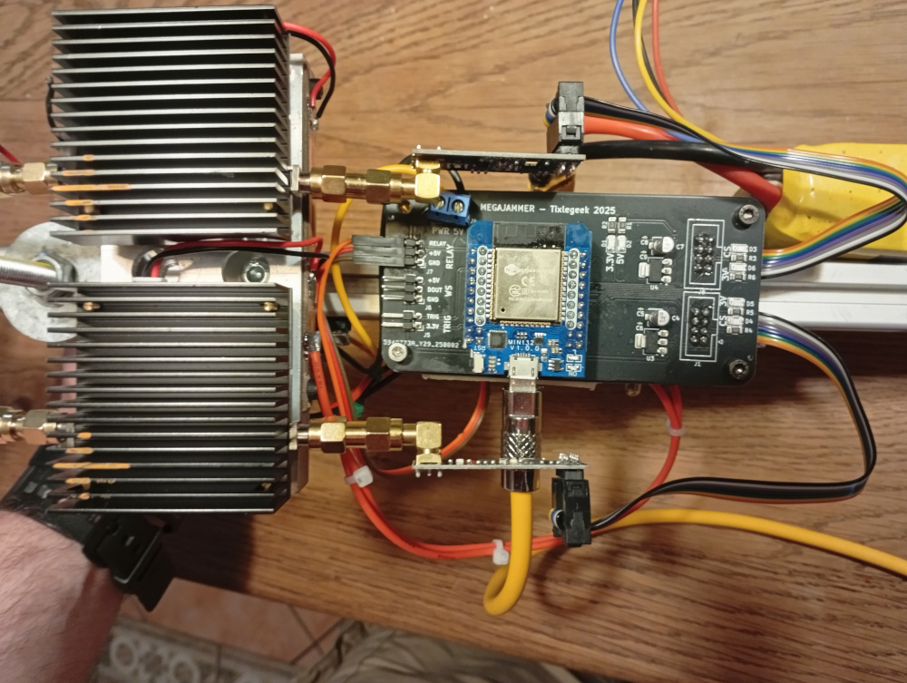

# MegaJammer



## **The 2.54 GHz Annoyance Cannon**

A janky yet effective directional jammer built from the finest garbage  AliExpress has to offer. Perfect for shutting down obnoxious Bluetooth  speakers, questionable IoT devices, and the occasional Wi-Fi network  

This is **illegal** in most civilized places. If the cyberpolice or any ham enthusiasts catches you, you'll be in hell.

I generated a list of channels for BT, WiFi 2.4, and Zigbee, but only tested BT. 

**This project is presented for educational and experimental purposes only.**

- **This is not a commercial product**
- **No schematics, support, or documentation are provided**
- **I am not affiliated with any manufacturer or distributor of this device**
- **I do not endorse or promote the use of this device**

**Do not use**

## Weaponizing Aliexpress

1. **NRF24L01+ Modules** – Cheap 2.4GHz transmitters set to blast carrier frequency at max power while  hopping on a list of channels.
2. **Sketchy RF Amplifiers** – Cheap and messy
3. **Yagi Antennas** – Because i needed this to be directional, not only because it looks mean.

Add more modules if you want to spit on more channels.

## Yeah but....

This project sounds impressive, but in reality it’s more of a toy than a tool. For a jammer to work, the emitter must be significantly closer to the receiver than the legitimate transmitter. Only then can it “shout” over the original signal — and that’s rarely the case in practice.

## How Jamming Works (and Why It Usually Doesn’t)

The principle is simple: transmit a strong interfering signal on the same frequency so the receiver’s **signal-to-noise ratio (SNR)** drops below the threshold needed for decoding.  
In Bluetooth/BLE, the SNR requirement is typically around **10-15 dB** for reliable communication.

If the legitimate signal arrives at the receiver with power Ps and your jammer provides Pj, jamming works if:

```math
\frac{P_s}{P_j + N} < \text{SNR}_\text{min}
```


where N is the background noise power.

---

Both Ps and Pj decay with distance according to the inverse-square law, or more precisely, the **Friis transmission equation**:

```math

P_r = P_t \cdot G_t \cdot G_r \cdot \left( \frac{\lambda}{4\pi R} \right)^2
```

Every doubling of distance reduces power by roughly **6 dB**.  
If your jammer is further from the receiver than the legitimate transmitter, you’re already losing before you start.

**In practice:**

- Cheap RF amplifiers for hobby use output maybe **0.5-2 W**.
- A Bluetooth device transmits at up to **100 mW** (Class 1).
- At typical indoor distances, you’d need **tens of watts** to reliably overpower a close transmitter.

## So, Is It Useless?

For Bluetooth/BLE — yes, mostly.  
The range and power requirements make it impractical unless you can put your jammer within a meter or two of the target receiver, and even then results vary. You could try:
- Bigger amplifiers
- Protocol attacks
- Frequency-hopping tracking

...but the improvement is marginal compared to the cost and complexity.

I built mine to silence my neighbor’s Bluetooth speaker.  
After running the numbers, I realized it would be cheaper and far more effective to just throw a rock at it.





you can see some other projects of mine [here](https://tixlegeek.io/splash).

**HppHckng!**
